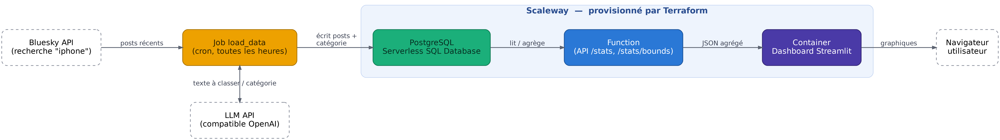
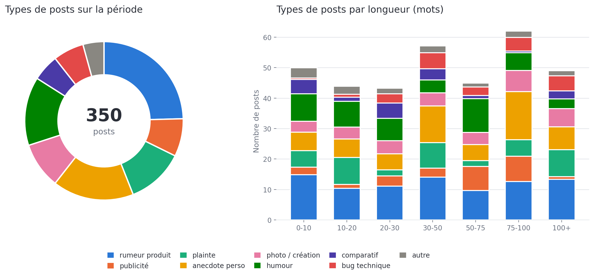

# Bluesky iPhone Posts — Pipeline & Dashboard

Un petit pipeline de données serverless, entièrement déployé sur **Scaleway** via **Terraform** : il collecte des posts Bluesky mentionnant "iphone", les classe automatiquement par catégorie avec un LLM, les stocke en base, et les restitue sous forme de dashboard interactif.

L'idée de départ : observer ce qui se dit sur l'iPhone en temps quasi-réel sur Bluesky, sans avoir à gérer le moindre serveur.

## Vue d'ensemble

Le projet s'articule autour de quatre briques, toutes provisionnées par Terraform et hébergées sur Scaleway :

1. **`code/load_data`** — un Job Scaleway, exécuté toutes les heures, qui interroge l'API Bluesky pour les posts récents contenant "iphone", les fait classer par un LLM dans une des dix catégories prédéfinies (rumeur produit, publicité, plainte, anecdote, humour, comparatif concurrent, bug technique...), puis les enregistre en base.
2. **`terraform/db.tf`** — une base PostgreSQL Serverless Scaleway qui stocke les posts et leur catégorie.
3. **`code/function`** — une Function Scaleway (Python) qui est la seule à parler à la base. Elle expose une petite API HTTP (`/stats`, `/stats/bounds`) qui agrège déjà les données côté serveur (comptage par catégorie, répartition par nombre de mots, emojis les plus utilisés) pour ne renvoyer que du JSON léger.
4. **`code/dashboard`** — une app Streamlit packagée en container, qui interroge la Function et affiche les résultats (camembert des catégories, histogramme empilé par longueur de post, emojis préférés par catégorie).

Tout est décrit en Infrastructure as Code dans le dossier `terraform/`, avec le provider officiel `scaleway/scaleway`.

## Le flux de données en détail

### 1. Collecte et classification (`code/load_data/main.py`)

Un script Python, packagé en image Docker et exécuté comme **Job Scaleway** planifié par cron (`0 * * * *`, toutes les heures) :

- Se connecte à Bluesky avec un compte applicatif (`atproto` + handle/app password).
- Recherche jusqu'à 500 posts récents (dernière heure) contenant le mot-clé "iphone" via `search_posts`.
- Pour chaque post, envoie le texte à un modèle LLM (`groq/openai/gpt-oss-20b`, via un endpoint compatible OpenAI) avec une liste de 10 catégories, et récupère l'index de la catégorie choisie.
- Enregistre chaque post (auteur, texte, catégorie, date) dans la table `Post` en PostgreSQL via l'ORM **Peewee**.
- Les erreurs de classification par post sont loguées mais n'interrompent pas le traitement des autres posts.

### 2. Stockage (`terraform/db.tf`)

Une base **Scaleway Serverless SQL Database** (PostgreSQL, autoscaling de 0 à 8 CPU). Un compte IAM applicatif dédié (`db_app`) reçoit une policy `ServerlessSQLDatabaseReadWrite`, et sa clé API sert à construire l'URL de connexion (`local.database_url`), réutilisée par la Function et par le Job (injectée comme secret Scaleway).

### 3. API d'agrégation (`code/function/function/handler.py`)

Une **Scaleway Serverless Function** Python, seule à détenir l'accès à la base de données (`psycopg2-binary` + Peewee). Trois routes :

- `GET /` — simple healthcheck ("Hello, world!").
- `GET /stats/bounds` — renvoie les dates min/max des posts en base, pour borner le slider du dashboard.
- `GET /stats?since=...&until=...` — calcule et renvoie, pour la période demandée :
  - le nombre total de posts,
  - le nombre de posts par catégorie,
  - la répartition par tranche de longueur (0-10, 10-20, ..., 100+ mots),
  - les emojis les plus fréquents par catégorie.

Tout le calcul lourd (parcours des lignes, comptage, extraction d'emojis par regex) se fait ici, côté serveur, pour que le dashboard n'ait jamais à manipuler les posts bruts.

`http_event.py` fournit des helpers génériques pour parser les events HTTP Scaleway (méthode, route, query params, body) quelle que soit la forme exacte de l'event reçu — utile car elle varie selon le type de déclencheur.

Le Job packaging est un peu particulier : `psycopg2-binary` est une extension C compilée, donc `terraform/function.tf` installe les dépendances dans un `null_resource` en utilisant l'image Docker officielle du runtime Python de Scaleway (`scwfunctionsruntimes-public/python-dep:3.12`), pour être sûr que le binaire compilé soit compatible avec l'environnement d'exécution réel — puis zippe le tout (`archive_file`) pour le déploiement.

### 4. Dashboard (`code/dashboard/app.py`)

Une app **Streamlit**, packagée en image Docker et déployée comme **Scaleway Container** (scale à 0, jusqu'à 1 instance) :

- Récupère les bornes de dates (`/stats/bounds`) pour proposer un slider de période.
- Récupère les stats agrégées (`/stats`) pour la période choisie (mise en cache 60s côté Streamlit).
- Affiche trois visualisations avec Plotly :
  - un **camembert** des types de posts sur la période,
  - un **histogramme empilé** des types de posts par tranche de longueur,
  - des **barres facettées** des emojis préférés, une facette par catégorie.
- Les huit catégories les plus fréquentes gardent une couleur fixe et dédiée (palette définie dans `app.py`) ; les catégories moins fréquentes sont regroupées sous "autre" pour ne pas surcharger les graphes.

Le dashboard ne fait jamais de requête directe à la base : il ne parle qu'à la Function, en JSON déjà agrégé.

*Aperçu (données fictives, mêmes couleurs et mêmes graphes que l'app réelle) :*

## Infrastructure Terraform (`terraform/`)

| Fichier | Rôle |
|---|---|
| `db.tf` | Provider Scaleway, base PostgreSQL Serverless, compte IAM + clé API pour s'y connecter |
| `registry.tf` | Registre de containers privé Scaleway, pour héberger les images du Job et du Dashboard |
| `function.tf` | Build des dépendances Python (via Docker), zip, déploiement de la Function |
| `dashboard.tf` | Build & push de l'image Docker du dashboard, déploiement en Scaleway Container |
| `job.tf` | Build & push de l'image Docker du job, définition du Job Scaleway avec son cron horaire et ses secrets |
| `secrets.tf` | Secrets Scaleway (mot de passe Bluesky, clé API OpenAI, URL de la base) référencés par le Job |
| `variables.tf` | Variables d'entrée (project_id, identifiants Bluesky, endpoint/clé OpenAI) |
| `outputs.tf` | Sorties : chaîne de connexion à la base (sensible), URL de la Function, URL publique du dashboard |

Un point notable : les images Docker (dashboard et job) et le zip de la Function sont **reconstruits et republiés automatiquement dès qu'un fichier source change**, grâce à un hash (`sha256` du contenu de chaque dossier de code) utilisé comme trigger de `null_resource` / `archive_file`. Un simple `terraform apply` après une modification du code suffit donc à redéployer.

## Développement local

- **Function** : `code/function/local_server.py` fait tourner `handler.py` en local (serveur HTTP stdlib pur, sans dépendance) pour tester les routes sans déployer — `./local_server.py --port 8080`.
- **Function (packaging manuel)** : `code/function/package.sh` reconstruit `function.zip` avec les dépendances compilées dans l'image Docker officielle du runtime, et peut déployer directement via `scw function deploy --deploy`.
- **Dashboard / Job** : chacun a son propre `Dockerfile`, buildable indépendamment (`docker build code/dashboard` / `docker build code/load_data`).

## Stack technique

- **Infra** : Terraform, provider `scaleway/scaleway`
- **Compute** : Scaleway Serverless Functions, Scaleway Containers, Scaleway Serverless Jobs (cron)
- **Données** : Scaleway Serverless SQL Database (PostgreSQL), ORM Peewee
- **Classification** : LLM via API compatible OpenAI (SDK `openai`)
- **Source de données** : API Bluesky (`atproto`)
- **Visualisation** : Streamlit + Plotly
